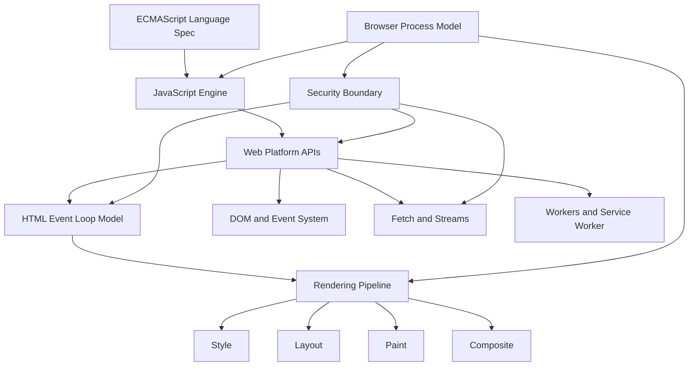

# Cross-Topic Architecture Diagram

Dokumen ini merangkum hubungan lintas topik utama: event loop, rendering pipeline, process model, dan security boundary.

## 1. Layered Architecture



## 2. Runtime Flow (Single Interaction)

```mermaid
sequenceDiagram
    participant User as User Input
    participant Browser as Browser Process
    participant Renderer as Renderer Main Thread
    participant Loop as Event Loop
    participant Net as Network Stack
    participant GPU as GPU/Compositor

    User->>Browser: Click / navigation intent
    Browser->>Renderer: Dispatch input task
    Renderer->>Loop: Run task (listener/script)
    Loop->>Loop: Drain microtasks
    Renderer->>Net: fetch() request (async)
    Net-->>Renderer: Response available
    Renderer->>Loop: Promise reactions (microtasks)
    Loop->>Renderer: Ready for rendering opportunity
    Renderer->>GPU: Layout/Paint/Composite pipeline
    GPU-->>User: Updated frame
```

## 3. Process Model View

```text
Browser Process
  - Navigation policy
  - Permission and security decisions
  - Process coordination

Renderer Process
  - DOM, JS execution, event dispatch
  - Main thread event loop
  - Rendering preparation

GPU Process
  - Compositing/raster path

Network/Utility Processes
  - Fetching resources
  - Supporting services
```

## 4. Security Boundary Injection Points

- Sebelum resource dibaca script: SOP/CORS checks.
- Sebelum API sensitif dipakai: Secure Context + Permissions checks.
- Sebelum capability tertentu aktif: isolation headers (COOP/COEP) dan policy (CSP/Trusted Types).

## 5. Related Topics

- [Event Loop](../event-loop/README.md)
- [Rendering Pipeline Interaction](../rendering-pipeline-interaction/README.md)
- [Browser Process Model Deep Dive](../browser-process-model-deep-dive/README.md)
- [Security Boundary](../security-boundary/README.md)
- [Glossary Istilah Wajib](../glossary/README.md)
